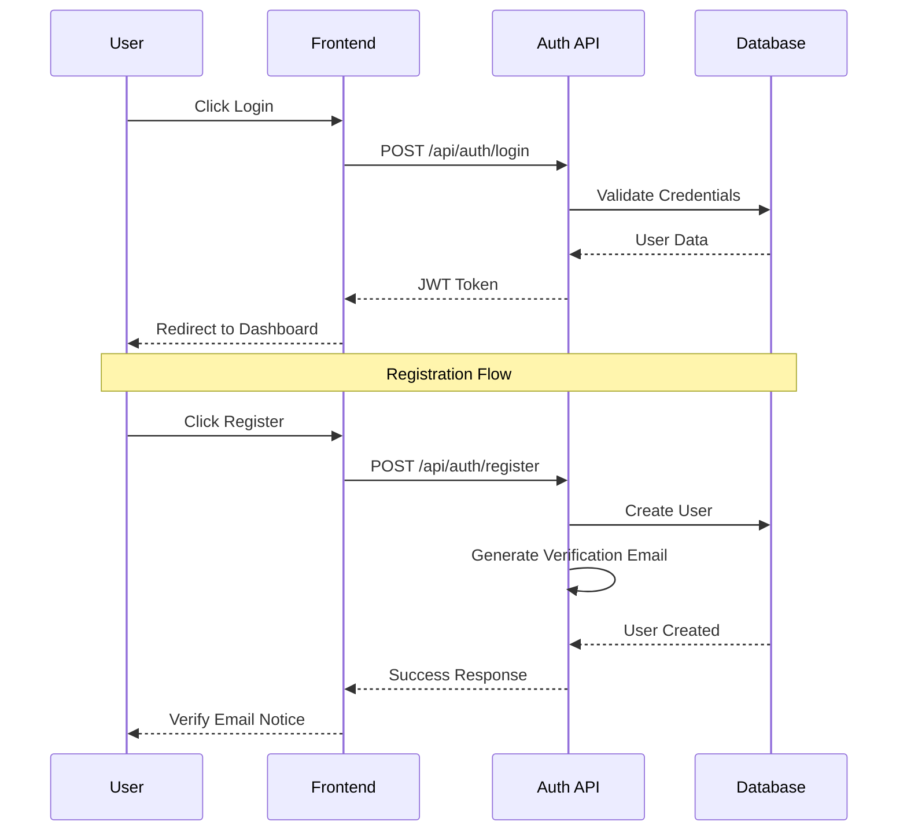
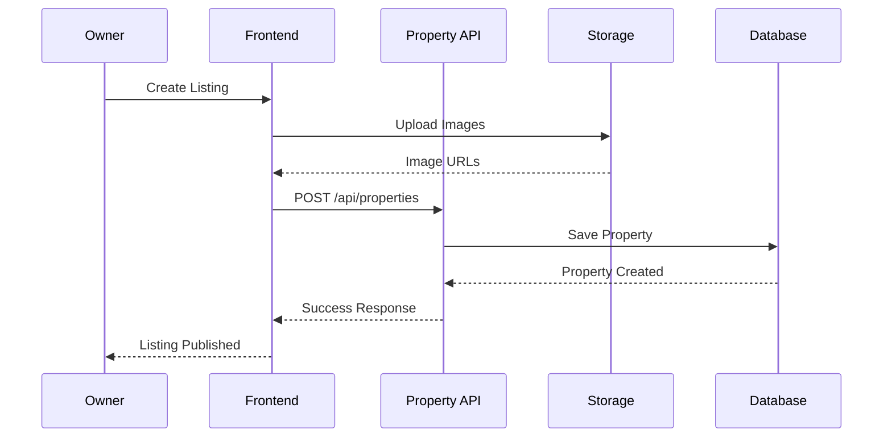
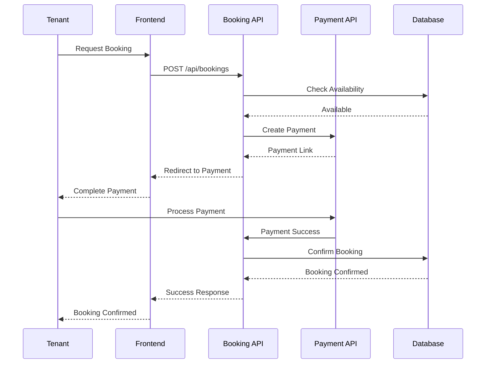
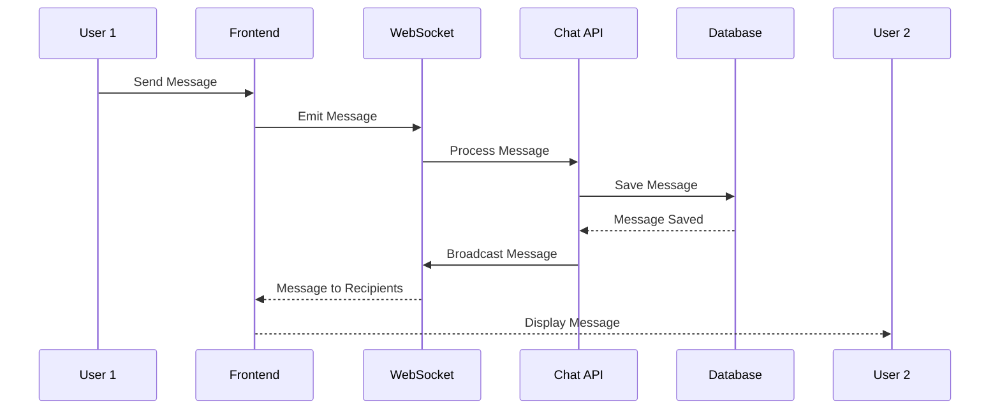
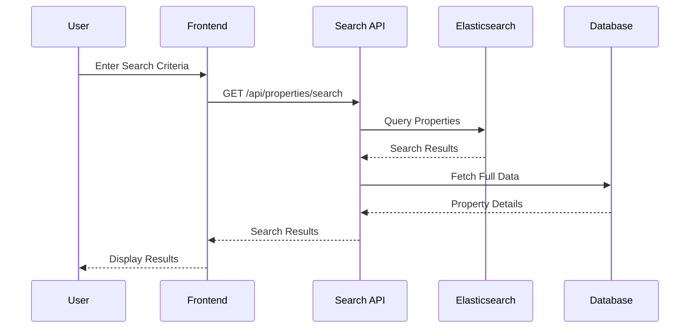
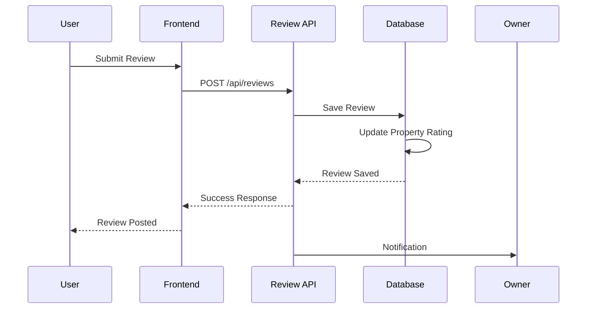
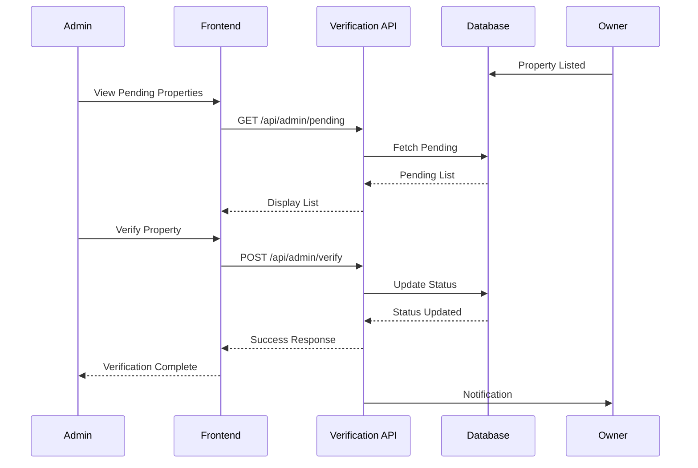

# Sequence Diagrams

## User Authentication Flow

```mermaid
sequenceDiagram
    participant U as User
    participant F as Frontend
    participant A as Auth API
    participant DB as Database
    
    U->>F: Click Login
    F->>A: POST /api/auth/login
    A->>DB: Validate Credentials
    DB-->>A: User Data
    A-->>F: JWT Token
    F-->>U: Redirect to Dashboard

    Note over U,DB: Registration Flow
    U->>F: Click Register
    F->>A: POST /api/auth/register
    A->>DB: Create User
    A->>A: Generate Verification Email
    DB-->>A: User Created
    A-->>F: Success Response
    F-->>U: Verify Email Notice
```

## Property Listing Flow

```mermaid
sequenceDiagram
    participant O as Owner
    participant F as Frontend
    participant P as Property API
    participant S as Storage
    participant DB as Database
    
    O->>F: Create Listing
    F->>S: Upload Images
    S-->>F: Image URLs
    F->>P: POST /api/properties
    P->>DB: Save Property
    DB-->>P: Property Created
    P-->>F: Success Response
    F-->>O: Listing Published
```

## Booking Flow

```mermaid
sequenceDiagram
    participant T as Tenant
    participant F as Frontend
    participant B as Booking API
    participant P as Payment API
    participant DB as Database
    
    T->>F: Request Booking
    F->>B: POST /api/bookings
    B->>DB: Check Availability
    DB-->>B: Available
    B->>P: Create Payment
    P-->>B: Payment Link
    B-->>F: Redirect to Payment
    F-->>T: Complete Payment
    T->>P: Process Payment
    P->>B: Payment Success
    B->>DB: Confirm Booking
    DB-->>B: Booking Confirmed
    B-->>F: Success Response
    F-->>T: Booking Confirmed
```

## Chat Flow

```mermaid
sequenceDiagram
    participant U1 as User 1
    participant F as Frontend
    participant WS as WebSocket
    participant C as Chat API
    participant DB as Database
    participant U2 as User 2
    
    U1->>F: Send Message
    F->>WS: Emit Message
    WS->>C: Process Message
    C->>DB: Save Message
    DB-->>C: Message Saved
    C->>WS: Broadcast Message
    WS-->>F: Message to Recipients
    F-->>U2: Display Message
```

## Property Search Flow

```mermaid
sequenceDiagram
    participant U as User
    participant F as Frontend
    participant S as Search API
    participant ES as Elasticsearch
    participant DB as Database
    
    U->>F: Enter Search Criteria
    F->>S: GET /api/properties/search
    S->>ES: Query Properties
    ES-->>S: Search Results
    S->>DB: Fetch Full Data
    DB-->>S: Property Details
    S-->>F: Search Results
    F-->>U: Display Results
```

## Review and Rating Flow

```mermaid
sequenceDiagram
    participant U as User
    participant F as Frontend
    participant R as Review API
    participant DB as Database
    participant O as Owner
    
    U->>F: Submit Review
    F->>R: POST /api/reviews
    R->>DB: Save Review
    DB->>DB: Update Property Rating
    DB-->>R: Review Saved
    R-->>F: Success Response
    F-->>U: Review Posted
    R->>O: Notification
```

## Admin Verification Flow

```mermaid
sequenceDiagram
    participant A as Admin
    participant F as Frontend
    participant V as Verification API
    participant DB as Database
    participant O as Owner
    
    O->>DB: Property Listed
    A->>F: View Pending Properties
    F->>V: GET /api/admin/pending
    V->>DB: Fetch Pending
    DB-->>V: Pending List
    V-->>F: Display List
    A->>F: Verify Property
    F->>V: POST /api/admin/verify
    V->>DB: Update Status
    DB-->>V: Status Updated
    V-->>F: Success Response
    F-->>A: Verification Complete
    V->>O: Notification
```
